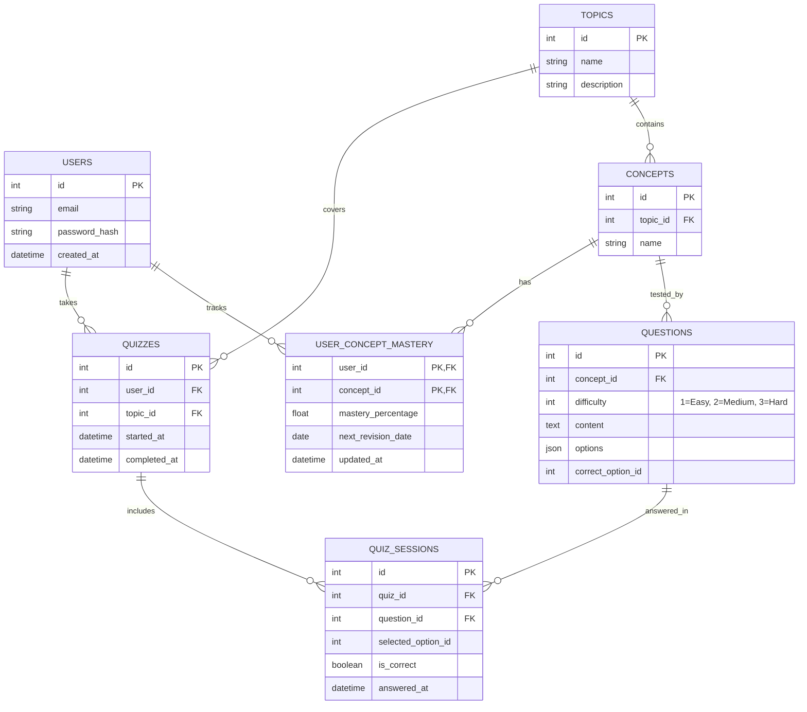

# 06. Database Design

This document outlines the relational database schema for the ConceptIQ MVP. The database is designed for SQLite initially (to facilitate rapid hackathon development), but uses standard relational patterns to allow seamless migration to PostgreSQL if required later.

## 1. Entity Relationship Diagram (ERD)

The core architectural decision is mapping `questions` and `mastery` directly to `concepts` rather than broad `topics`. This enables the granular adaptive learning loop.

## 2. Table Specifications

### 2.1. users
Stores authentication and basic profile data.

| Column | Type | Constraints | Description |
| :--- | :--- | :--- | :--- |
| `id` | Integer | Primary Key | Unique user identifier. |
| `email` | String | Unique, Not Null | Login email. |
| `password_hash` | String | Not Null | Hashed password. |
| `created_at` | DateTime | Default Now | Account creation timestamp. |

### 2.2. topics & concepts
Defines the hierarchical structure of knowledge. Topics are broad (e.g., Python), Concepts are granular and measurable (e.g., Base Cases).

**topics**
| Column | Type | Constraints | Description |
| :--- | :--- | :--- | :--- |
| `id` | Integer | Primary Key | |
| `name` | String | Unique, Not Null | e.g., "Python", "Java OOP" |

**concepts**
| Column | Type | Constraints | Description |
| :--- | :--- | :--- | :--- |
| `id` | Integer | Primary Key | |
| `topic_id` | Integer | Foreign Key | References `topics.id`. |
| `name` | String | Not Null | e.g., "Base Cases", "Polymorphism" |

### 2.3. questions
The question bank. Crucially, questions are mapped to *Concepts*, not Topics.

| Column | Type | Constraints | Description |
| :--- | :--- | :--- | :--- |
| `id` | Integer | Primary Key | |
| `concept_id` | Integer | Foreign Key | References `concepts.id`. |
| `difficulty` | Integer | Not Null | 1 (Easy), 2 (Medium), 3 (Hard). |
| `content` | Text | Not Null | The question text (Markdown supported). |
| `options` | JSON | Not Null | Array of possible answers `[{id: 1, text: "..."}]`. |
| `correct_option_id`| Integer | Not Null | The ID of the correct option. |

### 2.4. quizzes & quiz_sessions
Tracks a student's active engagement with the platform.

**quizzes** (Represents a single learning session/diagnostic run)
| Column | Type | Constraints | Description |
| :--- | :--- | :--- | :--- |
| `id` | Integer | Primary Key | |
| `user_id` | Integer | Foreign Key | References `users.id`. |
| `topic_id` | Integer | Foreign Key | The broad topic being studied. |

**quiz_sessions** (Logs individual answers within a quiz)
| Column | Type | Constraints | Description |
| :--- | :--- | :--- | :--- |
| `id` | Integer | Primary Key | |
| `quiz_id` | Integer | Foreign Key | References `quizzes.id`. |
| `question_id` | Integer | Foreign Key | References `questions.id`. |
| `selected_option_id`| Integer | Not Null | The option chosen by the user. |
| `is_correct` | Boolean | Not Null | Evaluated result (true/false). |
| `answered_at`| DateTime | Default Now | For measuring time taken per question. |

### 2.5. user_concept_mastery
The core table powering the adaptive engine and revision scheduling.

| Column | Type | Constraints | Description |
| :--- | :--- | :--- | :--- |
| `user_id` | Integer | Composite PK, FK | References `users.id`. |
| `concept_id` | Integer | Composite PK, FK | References `concepts.id`. |
| `mastery_percentage`| Float | Default 0.0 | Calculated score (0-100). |
| `next_revision_date`| Date | Nullable | Scheduled based on the revision algorithm. |
| `updated_at` | DateTime | Not Null | Timestamp of the last score update. |
